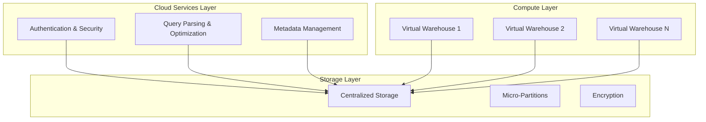

# Snowflake Architecture Diagram

```mermaid
flowchart TB
    subgraph CloudServices[Cloud Services Layer]
        A[Authentication & Security]
        B[Query Parsing & Optimization]
        C[Metadata Management]
    end

    subgraph Storage[Storage Layer]
        D[Centralized Storage]
        E[Micro-Partitions]
        F[Encryption]
    end

    subgraph Compute[Compute Layer]
        G1[Virtual Warehouse 1]
        G2[Virtual Warehouse 2]
        G3[Virtual Warehouse N]
    end

    A --> D
    B --> D
    C --> D
    G1 --> D
    G2 --> D
    G3 --> D
```

📌 This diagram shows Snowflake’s **three layers**: Cloud Services, Storage, and Compute.
