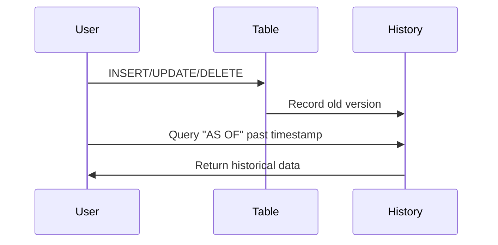

# Time Travel Flow Diagram

```mermaid
sequenceDiagram
    participant User
    participant Table
    participant History

    User->>Table: INSERT/UPDATE/DELETE
    Table->>History: Record old version
    User->>History: Query "AS OF" past timestamp
    History->>User: Return historical data
```

📌 Time Travel allows querying and restoring data **as of a point in the past**.
