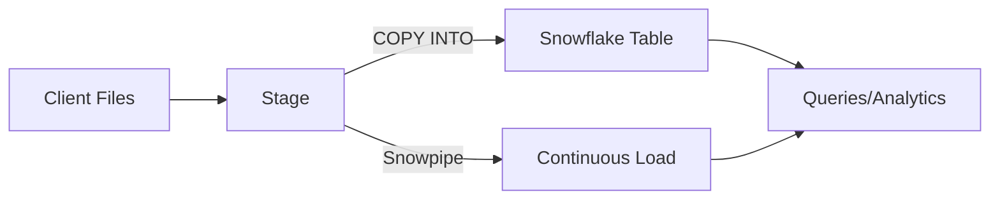

# Data Loading Flow Diagram

```mermaid
flowchart LR
    A[Client Files] --> B[Stage]
    B -->|COPY INTO| C[Snowflake Table]
    B -->|Snowpipe| D[Continuous Load]

    C --> E[Queries/Analytics]
    D --> E
```

📌 Data can be loaded into Snowflake via **stages**, either manually with `COPY INTO` or automatically using **Snowpipe**.
