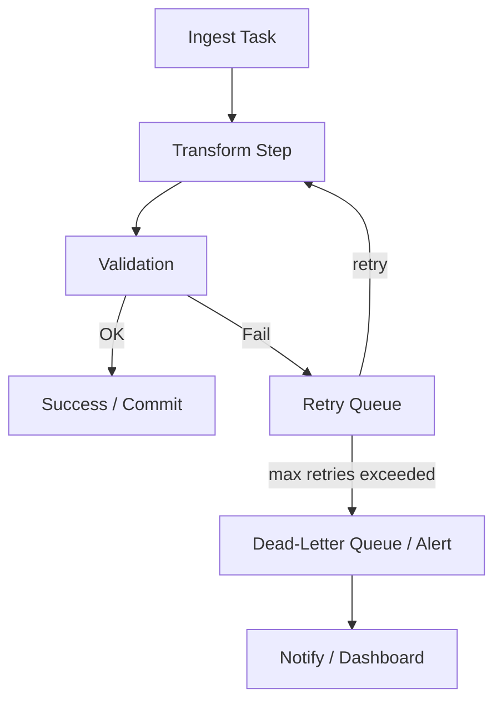

# Openflow Diagrams

This file contains several Mermaid diagrams illustrating common Openflow pipeline patterns:
- High-level ingestion flow
- CDC (Change Data Capture) pipeline
- Streaming (Kafka → Snowflake) pipeline
- Error handling & retry flow

> **Note:** GitHub renders Mermaid in Markdown on the web UI.  
> If you open this locally, you may see the raw code unless your editor supports Mermaid.

---

## 1. High-level Data Loading Flow

```mermaid
flowchart TD
  subgraph Sources
    A1[Files (S3 / GCS / Blob)]
    A2[Databases (SQL Server / MySQL)]
    A3[APIs / SaaS (REST)]
    A4[Streaming (Kafka / Kinesis)]
  end

  subgraph Openflow
    B1[Connector / Ingest]
    B2[Processors / Transforms]
    B3[Routing (to Stage or Direct)]
    B4[Monitoring / Alerts]
  end

  subgraph Snowflake
    C1[Stage (internal / external)]
    C2[Raw Tables / Streams]
    C3[Transform (dbt / Tasks)]
    C4[Analytics / BI / ML]
  end

  A1 --> B1
  A2 --> B1
  A3 --> B1
  A4 --> B1

  B1 --> B2
  B2 --> B3
  B3 --> C1
  B3 --> C2
  C1 --> C2
  C2 --> C3
  C3 --> C4

  B4 -.-> C4
```

---

## 2. CDC Pipeline (Database → Snowflake via Openflow)

```mermaid
flowchart LR
  subgraph OnPremDB
    DCDC[(CDC Stream)]
  end

  subgraph Openflow
    OConn[CDC Connector]
    OProc[Parse & Normalize]
    OMunge[Dedup / Upsert Logic]
    OToSnow[Write to Stage or Table]
  end

  subgraph Snowflake
    SStage["@db_cdc_stage"]
    SStream["orders_stream (STREAM)"]
    STable[orders (TABLE)]
  end

  DCDC --> OConn --> OProc --> OMunge --> OToSnow --> SStage
  SStage -->|COPY / Snowpipe| STable
  STable --> SStream
  SStream -->|MERGE| STable
```

---

## 3. Streaming Pipeline (Kafka → Openflow → Snowflake)

```mermaid
flowchart TB
  subgraph KafkaCluster
    KTopic[(kafka.topic.events)]
  end

  subgraph Openflow
    KConnector[Kafka Connector]
    Parser[JSON Parser / Schema Registry]
    Enricher[Enrichment / Lookup]
    Sink[Snowflake Sink (Stream / Table)]
  end

  subgraph Snowflake
    Stage["@kafka_stage"]
    RawTbl[raw_events]
    ProcTbl[events_clean]
  end

  KTopic --> KConnector --> Parser --> Enricher --> Sink
  Sink --> Stage
  Stage -->|Snowpipe| RawTbl
  RawTbl --> ProcTbl
```

---

## 4. Error Handling & Retry Flow



---

## Plain-text fallback (if Mermaid doesn’t render)

- **High-level flow:**  
  Sources → Openflow (Connectors → Processors → Routing) → Snowflake (Stage → Raw Tables → Transforms) → Consumers (BI / ML)

- **CDC flow:**  
  DB CDC → Openflow → Stage → COPY/Snowpipe → Raw table → Stream + MERGE → Final table

- **Streaming flow:**  
  Kafka → Openflow → Stage → Snowpipe → Raw table → Processed table

- **Retry flow:**  
  Ingest → Transform → Validate → (OK → Commit) / (Fail → Retry queue → Dead-letter + alert)
