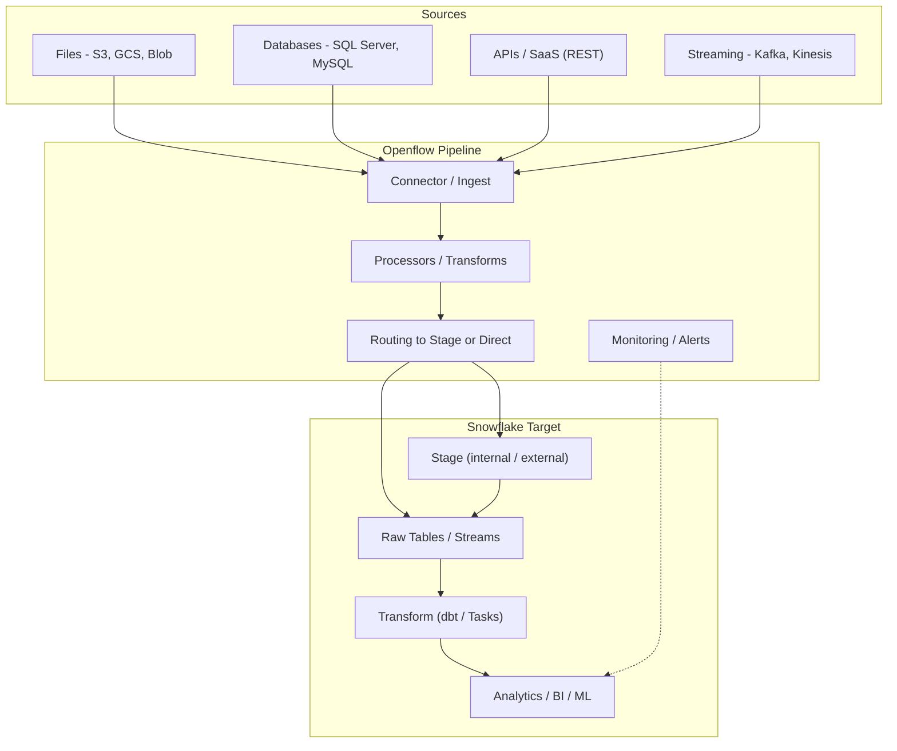
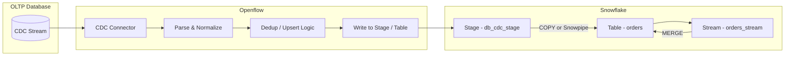
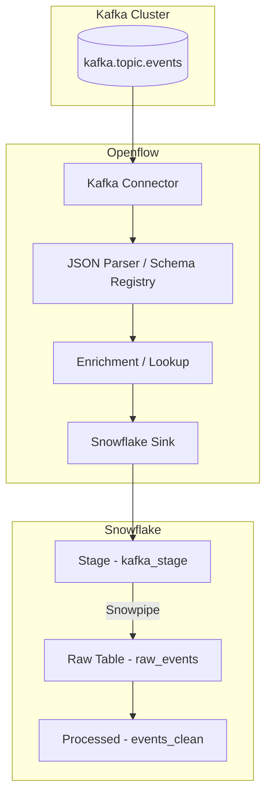
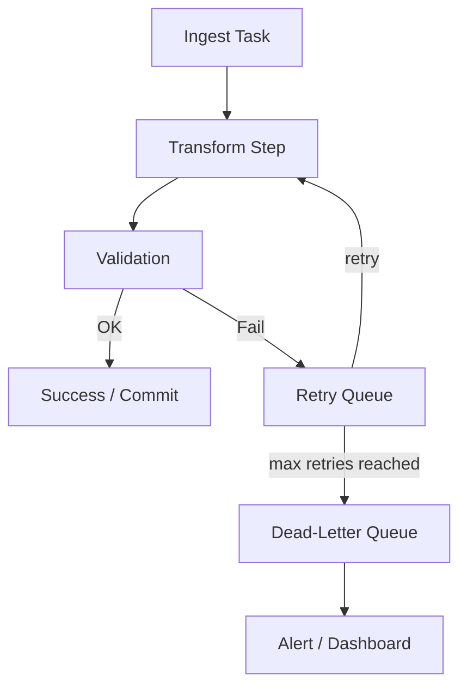

# Openflow Diagrams

This file contains several Mermaid diagrams illustrating common Openflow pipeline patterns:
- High-level ingestion flow
- CDC (Change Data Capture) pipeline
- Streaming (Kafka → Snowflake) pipeline
- Error handling & retry flow

> **Note:** GitHub renders Mermaid in Markdown on the web UI.  
> If you open this locally, you may see the raw code unless your editor supports Mermaid.

---

## 1. High-level Data Loading Flow

---

## 2. CDC Pipeline (Database → Snowflake via Openflow)

---

## 3. Streaming Pipeline (Kafka → Openflow → Snowflake)

---

## 4. Error Handling & Retry Flow

---

## Plain-text fallback (if Mermaid doesn’t render)

- **High-level flow:**  
  Sources → Openflow (Connectors → Processors → Routing) → Snowflake (Stage → Raw Tables → Transforms) → Consumers (BI / ML)

- **CDC flow:**  
  DB CDC → Openflow → Stage → COPY/Snowpipe → Raw table → Stream + MERGE → Final table

- **Streaming flow:**  
  Kafka → Openflow → Stage → Snowpipe → Raw table → Processed table

- **Retry flow:**  
  Ingest → Transform → Validate → (OK → Commit) / (Fail → Retry queue → Dead-letter + alert)
