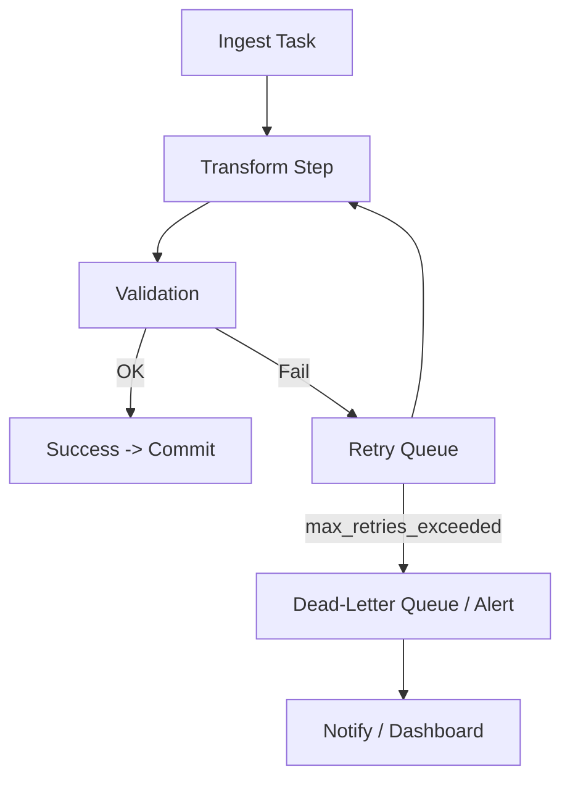

# Openflow Diagrams

This file contains several Mermaid diagrams illustrating common Openflow pipeline patterns:
- High-level ingestion flow
- CDC (Change Data Capture) pipeline
- Streaming (Kafka → Snowflake) pipeline
- Error handling & retry flow

> **Note:** GitHub supports Mermaid rendering in Markdown. The diagrams below are in fenced ```mermaid``` blocks and will render on GitHub's web UI.

---

## 1. High-level Data Loading Flow

```mermaid
flowchart TD
  subgraph Sources [Data Sources]
    A1[Files (S3 / GCS / Blob)]
    A2[Databases (SQL Server / MySQL)]
    A3[APIs / SaaS (REST)]
    A4[Streaming (Kafka / Kinesis)]
  end

  subgraph Openflow [Openflow Pipeline]
    B1[Connector / Ingest]
    B2[Processors / Transforms]
    B3[Routing (to Stage or Direct)]
    B4[Monitoring / Alerts]
  end

  subgraph Snowflake [Snowflake Target]
    C1[Stage (internal/external)]
    C2[Raw Tables / Streams]
    C3[Transform (dbt / Tasks)]
    C4[Analytics / BI / ML]
  end

  A1 --> B1
  A2 --> B1
  A3 --> B1
  A4 --> B1

  B1 --> B2
  B2 --> B3
  B3 --> C1
  B3 --> C2
  C1 --> C2
  C2 --> C3
  C3 --> C4

  B4 -.-> C4
```

**Explanation:** Sources feed Openflow connectors. Data is processed, routed to a stage or directly into raw tables/streams in Snowflake, then transformed (e.g., dbt/Tasks) and consumed by analytics or ML.

---

## 2. CDC Pipeline (Database → Snowflake via Openflow)

```mermaid
flowchart LR
  subgraph OnPremDB [OLTP DB (SQL Server)]
    DCDC[(CDC Stream)]
  end

  subgraph Openflow
    OConn[CDC Connector]
    OProc[Debezium-like Parse & Normalize]
    OMunge[Dedup / Upsert Logic]
    OToSnow[Write to Stage / Table]
  end

  subgraph Snowflake
    SStage[@db_cdc_stage]
    SStream[orders_stream (STREAM)]
    STable[orders (TABLE)]
  end

  DCDC --> OConn --> OProc --> OMunge --> OToSnow --> SStage
  SStage -->|COPY / Snowpipe| STable
  STable --> SStream
  SStream -->|MERGE| STable
```

**Explanation:** Openflow reads DB CDC (transaction logs), normalizes events, writes to a stage (or directly), then Snowflake ingests (COPY/Snowpipe) and an internal stream + MERGE apply changes to the final table.

---

## 3. Streaming Pipeline (Kafka → Openflow → Snowflake)

```mermaid
flowchart TB
  subgraph KafkaCluster
    KTopic[(kafka.topic.events)]
  end

  subgraph Openflow
    KConnector[Kafka Connector]
    Parser[JSON Parser / Schema Registry]
    Enricher[Enrichment / Lookup]
    Sink[Snowflake Sink (Stream/Table)]
  end

  subgraph Snowflake
    Stage[@kafka_stage]
    RawTbl[raw_events]
    ProcTbl[events_clean]
  end

  KTopic --> KConnector --> Parser --> Enricher --> Sink
  Sink --> Stage
  Stage -->|Snowpipe| RawTbl
  RawTbl --> ProcTbl
```

**Explanation:** A streaming source (Kafka) connects to Openflow, which parses and enriches events and pushes them into Snowflake (via stage + Snowpipe or direct sink), where downstream transforms produce clean tables for analytics.

---

## 4. Error Handling & Retry Flow



**Explanation:** Typical pipeline control flow with validation, retry logic and dead-lettering. Openflow provides built-in retry/backoff and monitoring hooks to reprocess or alert on poisoned records.

---

## 5. Optional: Dev/Test vs Prod Flow (Environment Isolation)

```mermaid
flowchart LR
  Dev[Dev Openflow Instance] --> DevStage[@dev_stage] --> DevTable[dev_table]
  Prod[Prod Openflow Instance] --> ProdStage[@prod_stage] --> ProdTable[prod_table]

  Dev -. Test Changes .-> Prod
  Prod -->|Monitoring| Ops[Alerts & Observability]
```

**Explanation:** Keep dev/test flows isolated from production; use cloning or branches for safe testing and apply CI/CD for flow deployments.

---

## Notes & Tips
- Keep diagrams **simple and layered**: Sources → Openflow → Snowflake → Consumers.  
- Use **stages** for reliability (especially for large files or bursts) and **Snowpipe** for near-real-time loads.  
- Represent error/retry paths explicitly — production pipelines need clear dead-letter handling and observability.  
- Git-friendly: Save the Mermaid blocks in Markdown files; GitHub will render them automatically in the repo viewer.

---
