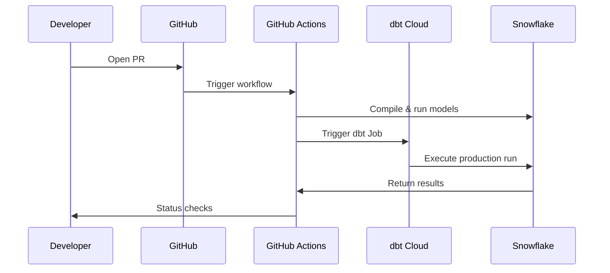
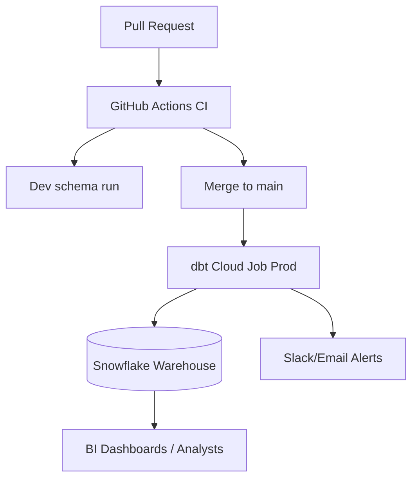

# CI/CD for dbt on Snowflake — practiced patterns

Automating dbt runs ensures that every model change is tested, documented, and deployed consistently. This doc walks through PR validation, environment promotion, dbt Cloud Jobs, and runbooks for rollbacks.

---

## Why CI/CD for dbt?

Without automation:
- Developers manually run models → prone to error.
- Tests get skipped under pressure.
- Deployments vary from one engineer to another.

With CI/CD:
- Every pull request triggers compile & tests.
- Artifacts (docs, manifest.json) are generated for visibility.
- Deployments are consistent and auditable.
- dbt jobs run on schedule or on demand.

---

## Pipeline story

Imagine Alice opens a PR to add a new model `fct_sales`. Here’s what happens:

1. GitHub triggers CI.
2. CI installs dbt, generates a `profiles.yml` from secrets.
3. `dbt compile` validates SQL and dependencies.
4. `dbt run --models fct_sales` runs fast tests in a dev schema.
5. `dbt test` validates quality.
6. If merged, CI deploys to production schema and triggers dbt Cloud Job for full refresh.



---

## Typical pipeline stages

1. **Pull Request CI**  
   - Lint, compile, and run `dbt run --select tag:ci` (fast subset).  
   - Fail fast on SQL errors or broken refs.

2. **Main branch merge**  
   - Run full `dbt run`, `dbt test`.  
   - Generate docs (`dbt docs generate`) and publish artifacts.

3. **Deploy to Prod**  
   - Trigger dbt Cloud Job or run `dbt run --target prod`.  
   - Apply incremental models with MERGE.  
   - Run smoke tests.

4. **Post-release monitoring**  
   - Validate key metrics.  
   - Alert on anomalies.

---

## dbt Cloud Jobs integration

In addition to CI pipelines, dbt Cloud provides **Jobs**: scheduled runs of commands with logging, artifacts, and alerts.

- Jobs can run on schedule (e.g., hourly, daily) or be triggered via API/CI.  
- Each job can run with a target profile (`dev`, `staging`, `prod`).  
- Notifications can be sent to Slack, email, or webhooks on success/failure.  

### Example: Trigger dbt Cloud Job from GitHub Actions

```yaml
jobs:
  deploy:
    runs-on: ubuntu-latest
    steps:
      - name: Trigger dbt Cloud Job
        run: |
          curl -X POST https://cloud.getdbt.com/api/v2/accounts/${{ secrets.DBT_ACCOUNT_ID }}/jobs/${{ secrets.DBT_JOB_ID }}/run/ \
            -H "Authorization: Token ${{ secrets.DBT_CLOUD_API_TOKEN }}" \
            -H "Content-Type: application/json" \
            -d '{"cause": "Triggered from GitHub Actions"}'
```

This ensures production runs are executed in dbt Cloud with proper logging and lineage.

---

## Promotion strategies

- **Blue/Green**: build models in shadow schema, validate, then swap.  
- **Shadow deploy**: compare outputs with prod tables before cutover.  
- **Schema versioning**: suffix schemas with `_v1`, `_v2` for migration control.

---

## Rollback & incident response

- Use **Snowflake Time Travel** to restore dropped/replaced tables.  
- Maintain **backup snapshots** of critical fact tables.  
- Document runbooks: who to alert, how to revert, how to replay jobs.

---

## Putting it all together

CI/CD + dbt Jobs create a complete workflow:



---

Next: [performance-and-best-practices.md](./performance-and-best-practices.md) — optimizing costs and speed.
