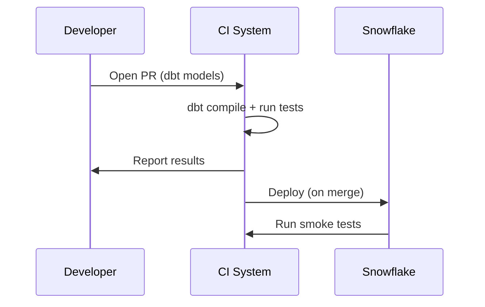

# CI/CD for dbt on Snowflake — practiced patterns

Automating dbt runs ensures that every model change is tested, documented, and deployed consistently. This doc walks through PR validation, environment promotion, and runbooks for rollbacks.

---

## Core principles
- **Fail fast**: run `dbt compile` and `dbt test` on PRs.
- **Immutable artifacts**: generate compiled artifacts and docs for each release.
- **Promotion flow**: promote models from `dev` -> `staging` -> `prod` with controlled migrations.
- **Least privilege**: use scoped service accounts for CI jobs.

---

## Typical pipeline stages
1. **Pull Request CI**: compile, run static checks, small subset of tests (fast).
2. **Merge to main**: run full test suite, docs generation, and artifact upload.
3. **Deploy to Prod**: apply migrations, run incremental models, smoke tests.
4. **Post-release monitoring**: run validation queries and gather metrics.

---

## GitHub Actions example (expanded)
Securely create `profiles.yml` during the workflow using secrets. Run fast tests on PR and full tests on main/merge.

(Refer to setup.md for base profile creation snippet.)

Key steps:
- `dbt compile` to check syntax
- `dbt run --models tag:fast` to run fast models only on PRs
- `dbt test` (schema + data tests) for main branch
- `dbt docs generate` and upload site as artifact or publish to static host

---

## Promotion strategy (blue/green or shadow)
- Blue/green: deploy new models to a `new` schema, run validations; if green, switch consumers to new schema via view/synonym swap.
- Shadow deploy: run new models in parallel (different schema) and compare results with current production tables before switching over.

---

## Rollback & incident response
- Keep automated `backup` snapshots or use Snowflake Time Travel for quick rollback of replaced tables.
- Document runbooks for failed merges and data drift warnings.

---

Next: [performance-and-best-practices.md](./performance-and-best-practices.md) — optimizing costs and speed.