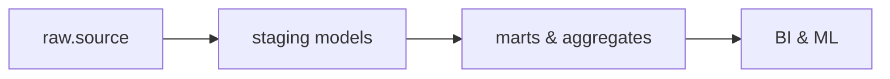

# Models & Transformations (dbt + Snowflake) — deep dive

This doc covers practical modeling patterns, materializations, incremental strategies, snapshot usage, macros, and Snowflake-aware SQL patterns. Expect copy-paste-ready recipes and anti-patterns to avoid.

---

## dbt model anatomy & compilation
- A dbt model is a `.sql` file; the compiled SQL replaces Jinja templating and `ref()` calls with actual schema names.
- Use `{{ ref('stg_customers') }}` to depend on staging models. dbt builds the DAG and orchestrates execution order.



---

## Materializations: when to use what
- **view**: light-weight, good for iterative development and small transformations. Be cautious: views execute underlying SQL each time and can be costly in BI dashboards.
- **table**: useful for complex, expensive models you want to cache; full-refresh replaces the table.
- **incremental**: best for large, append/streaming datasets; apply MERGE for upserts.
- **ephemeral**: for small reused transforms; compiled inline and not created as objects.

Example: set default materialization in `dbt_project.yml` and override per-model.

---

## Incremental model — robust MERGE pattern for Snowflake
Use MERGE to upsert new and changed rows efficiently. This pattern handles inserts, updates, and soft deletes.

```sql
-- models/marts/incremental_orders.sql
{{ config(materialized='incremental', unique_key='order_id') }}

with source_data as (
  select order_id, status, amount, updated_at
  from {{ source('raw','orders') }}
  where updated_at >= (select coalesce(max(updated_at), '1900-01-01') from {{ this }})
)


  select * from source_data

  -- MERGE into target table
  merge into {{ this }} as tgt
  using (select * from source_data) as src
  on tgt.order_id = src.order_id
  when matched and src.updated_at > tgt.updated_at then
    update set status = src.status, amount = src.amount, updated_at = src.updated_at
  when not matched then
    insert (order_id, status, amount, updated_at) values (src.order_id, src.status, src.amount, src.updated_at);

```

**Notes**:
- Ensure `unique_key` matches table constraints for deterministic merges.
- For very wide tables, select only needed columns in `source_data` to reduce scan costs.

---

## Snapshots for SCDs
dbt snapshots capture historical changes for slowly changing dimensions: use `strategy: timestamp` or `strategy: check` in `snapshots/` definitions.

```yaml
# snapshots/customers_snapshot.sql (config in YAML)

{{
  config(
    target_schema='snapshots',
    unique_key='customer_id',
    strategy='timestamp',
    updated_at='updated_at'
  )
}}
select * from {{ source('raw','customers') }}

```

Snapshots create a table with versioning and validity timestamps; useful when you need temporal history for attributes.

---

## Macros: reusable merge logic
Define macros for common MERGE patterns to avoid repetition and reduce risk.

```sql
-- macros/merge_into.sql

merge into {{ target }} as t
using {{ source }} as s
on {{ keys }}
when matched then update set {{ columns }}
when not matched then insert ({{ columns }}) values ({{ columns }});

```

Invoke macro with proper arguments to produce consistent MERGE statements across models.

---

## Sources, exposures & lineage
- Use `sources:` to declare raw tables and capture freshness expectations.
- Exposures document dashboards or downstream consumers and tie models to business metrics.
- `dbt docs generate` produces a visual DAG useful for stakeholder reviews.

---

## Snowflake-specific tips
- Use `COPY INTO`/external stages for large parquet/avro loads — dbt handles modeling after landing data.
- Consider clustering keys on very large tables to improve predicate performance for common filters.
- Monitor query history to find expensive transformations; add search optimization if needed.

---

## Example recipes & anti-patterns
- **Recipe**: small staging models as `view`, then incremental marts as `table` or `incremental`.
- **Anti-pattern**: create massive monolithic models that recalculate everything on each run.
- **Recipe**: use ephemeral models for small reusable expressions to reduce object sprawl.

---

Next: [testing-and-documentation.md](./testing-and-documentation.md) — build confidence with tests and docs.