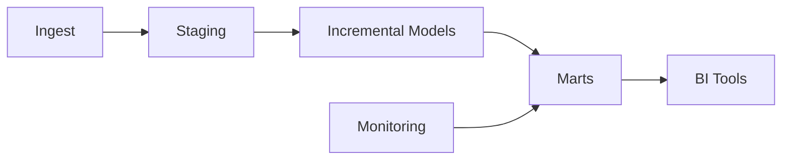

# Performance & Best Practices (dbt on Snowflake)

This guide focuses on real-world optimizations: minimizing credits, accelerating queries, and choosing the right materializations and clustering in Snowflake for dbt workloads.

---

## Core ideas
- **Right-size compute**: scale warehouses based on workload patterns.
- **Avoid full-refreshes**: leverage incremental models and selective backfills.
- **Control concurrency**: limit `threads` and use dedicated warehouses for dbt.
- **Prune data early**: select only necessary columns and partition/filter when possible.

---

## Warehouse sizing & cost control
- Use smaller warehouses for development, larger for heavy jobs or scheduled full-rebuilds.
- Auto-suspend and auto-resume settings reduce idle costs.
- Monitor credit usage with ACCOUNT_USAGE views and third-party tools.

## Clustering & micro-partitioning
- Snowflake micro-partitions are automatic; clustering keys help with range-pruning for very large tables.
- Choose clustering keys based on common filter columns (date, region, user_id).
- Beware clustering maintenance costs — reclustering can be expensive.

## Query tuning patterns
- Push filters down to the `source_data` CTE in incremental models.
- Avoid wide `SELECT *` in marts; select only used columns.
- Use `materialized views` sparingly — consider if they reduce execution costs.

## Observability & monitoring
- Store dbt run metadata and test results in a `monitoring` schema.
- Capture query profiles, warehouse credit usage, and failed job metrics.
- Integrate with observability stack (Datadog, Prometheus) if needed.

## Cost-aware modeling patterns
- Favor incremental + MERGE for large streaming datasets.
- Use transient tables for intermediate heavy aggregations to avoid long-term storage costs.
- Schedule heavy batch jobs during off-peak times if using shared credits in an organization.

---

Next: [resources.md](./resources.md) — curated links and example repos.