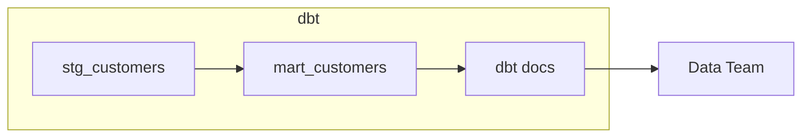

# Testing & Documentation (dbt + Snowflake)

Reliable data products are tested and documented. This doc shows practical tests, custom assertions, docs generation and how to integrate with Snowflake's metadata for governance.

---

## dbt tests: types & patterns
- **Schema tests**: declared in `schema.yml` (e.g., `not_null`, `unique`, `accepted_values`).
- **Data tests**: SQL files that return zero rows on success (assertions).
- **Custom tests**: macros to express company-specific logic.

Example schema.yml:

```yaml
version: 2
models:
  - name: customers
    description: "staged customer data"
    columns:
      - name: customer_id
        description: "primary id"
        tests:
          - not_null
          - unique
      - name: email
        tests:
          - not_null
          - unique
```

Data test example (`tests/no-missing-emails.sql`):

```sql
select * from {{ ref('customers') }} where email is null;
```

Run tests: `dbt test --profiles-dir ~/.dbt`

---

## Documentation & lineage
- Add `description:` fields to models and columns. Generate docs:

```bash
dbt docs generate --profiles-dir ~/.dbt
dbt docs serve --profiles-dir ~/.dbt
```

- The docs site includes DAG visualization and column-level docs. Use exposures to map models to dashboards and owners.



---

## Data quality framework & monitoring
- Combine dbt tests with Snowflake tasks or external monitors to run periodic checks.
- Send failing tests to alerting systems (Slack, PagerDuty) via CI hooks.
- Maintain historical test results in a `monitoring` schema to audit data quality trends.

---

## Test-driven development (TDD) for analytics
1. Start by writing a failing data test (e.g., expect non-null user ids).  
2. Implement a model or fix upstream source.  
3. Re-run tests & iterate until green.  
This ensures transformations meet contract before production deployment.

---

## Versioned docs & release notes
- Use git tags and CHANGELOG to track changes. Include `whats-new/2025/2-dbt-integration` notes for major integration changes and migrations.
- Link doc site snapshots to release artifacts for compliance and audits.

---

Next: [ci-cd.md](./ci-cd.md) — automated, safe deployment workflows.