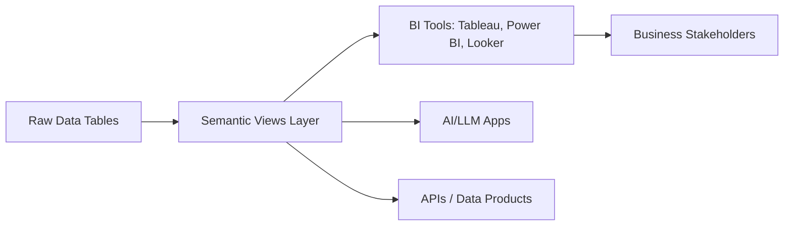

# Snowflake Semantic Views (Feb 2025)

Welcome to the **Snowflake Semantic Views** module!  
Semantic Views represent Snowflake's answer to the long-standing "metrics layer" challenge: a centralized, governed way to define measures, dimensions, and business logic once — and reuse everywhere (BI, APIs, AI).

---

## 📖 Contents

1. [Introduction](./2-intro.md)  
2. [Setup](./3-setup.md)  
3. [Modeling & Usage](./4-modeling-and-usage.md)  
4. [Testing & Validation](./5-testing-and-validation.md)  
5. [CI/CD & Deployment](./6-ci-cd-and-deployment.md)  
6. [Performance & Best Practices](./7-performance-and-best-practices.md)  
7. [Resources](./8-resources.md)

---

## 🎯 Learning Outcomes

By completing this module, you will be able to:
- Understand what Semantic Views are and why they matter.
- Create semantic views in Snowflake to define consistent metrics.
- Integrate semantic views into BI tools and APIs.
- Validate, test, and version semantic views safely.
- Automate deployments with CI/CD.
- Optimize semantic layer performance for enterprise workloads.

---

## 📊 High-level Diagram

