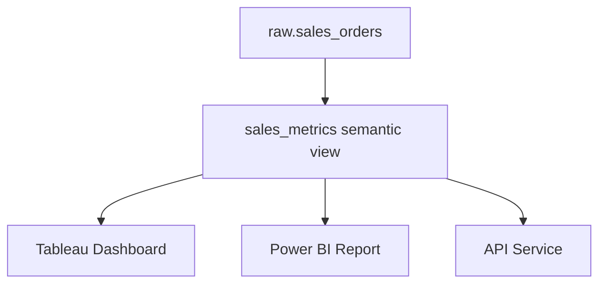

# Setting up Semantic Views in Snowflake

## 🚀 Enabling Semantic Views

Semantic Views are a 2025 Snowflake feature (may require enterprise edition or feature flag). Check availability:

```sql
show parameters like 'ENABLE_SEMANTIC_VIEWS';
```

Enable at the account or session level:

```sql
alter account set ENABLE_SEMANTIC_VIEWS = true;
```

---

## 🛠️ Creating a Semantic View

### Example: Sales Metrics

```sql
create or replace semantic view sales_metrics
as
select
  customer_id,
  order_id,
  amount as revenue,
  order_date::date as order_day
from raw.sales_orders;
```

Now BI tools or analysts can query `sales_metrics` directly.

---

## 🔐 Permissions

```sql
grant usage on semantic view sales_metrics to role analyst_role;
```

RBAC applies just like tables/views.

---

## 📊 Diagram


