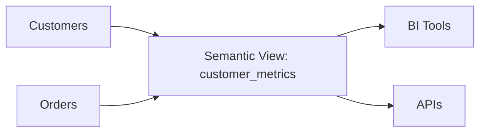

# Modeling & Usage of Semantic Views

## Defining Metrics & Dimensions

A semantic view can include:
- **Metrics** (Revenue, Active Users, Retention Rate)
- **Dimensions** (Date, Region, Product Category)
- **Relationships** (Customer ↔ Orders ↔ Products)

### Example

```sql
create or replace semantic view customer_metrics
as
select
  c.customer_id,
  c.region,
  count(distinct o.order_id) as order_count,
  sum(o.amount) as total_spent,
  avg(datediff('day', c.signup_date, current_date)) as customer_age_days
from raw.customers c
left join raw.orders o on c.customer_id = o.customer_id
group by c.customer_id, c.region;
```

---

## Querying Semantic Views

```sql
select region, avg(total_spent) as avg_spend
from customer_metrics
group by region;
```

Downstream tools consume this view as if it were a table.

---

## Best Practices
- Use descriptive, business-friendly column names.
- Include both raw identifiers and human-readable labels.
- Apply role-based filters if sensitive metrics are included.

---

## Visualization Diagram


