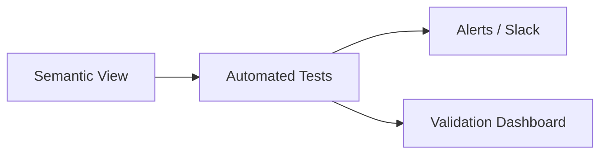

# Testing & Validation of Semantic Views

Ensuring semantic views are correct is critical — otherwise, “single source of truth” becomes “single point of error.”

---

## ✅ Testing Patterns

### 1. Schema Validation
Check nullability, uniqueness, and consistency of metrics.

```sql
select * from customer_metrics where customer_id is null;
```

### 2. Reconciliation Tests
Compare against source-of-truth reports.

```sql
select count(*) from customer_metrics
minus
select count(distinct customer_id) from raw.customers;
```

### 3. dbt + Semantic Views
Use dbt to wrap semantic view queries into models/tests.

---

## 🧪 Automated Validation

- Run validation queries in CI/CD pipelines.  
- Trigger dbt tests nightly on semantic views.  
- Store validation results in a monitoring schema.  

---

## Diagram


