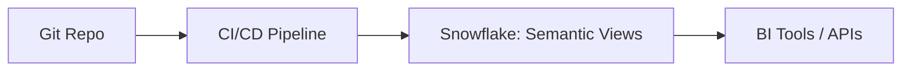

# CI/CD & Deployment of Semantic Views

## Why CI/CD?
Semantic Views are code. Treat them like dbt models or SQL objects:
- Version control in Git
- PR reviews for changes
- Automated deployment

---

## GitHub Actions Workflow Example

```yaml
name: semantic-views-ci

on: [push, pull_request]

jobs:
  deploy:
    runs-on: ubuntu-latest
    steps:
      - uses: actions/checkout@v4
      - name: Install SnowSQL
        run: pip install snowflake-connector-python
      - name: Deploy Semantic Views
        run: |
          snowsql -a ${{ secrets.SF_ACCOUNT }} -u ${{ secrets.SF_USER }} -p ${{ secrets.SF_PASSWORD }} -q "
          create or replace semantic view sales_metrics as
          select * from raw.sales_orders;"
```

---

## dbt Integration

dbt will soon natively support `semantic view` objects:
- Wrap semantic view definitions in dbt models.  
- Deploy via `dbt run`.  
- Test via `dbt test`.  

---

## Diagram


