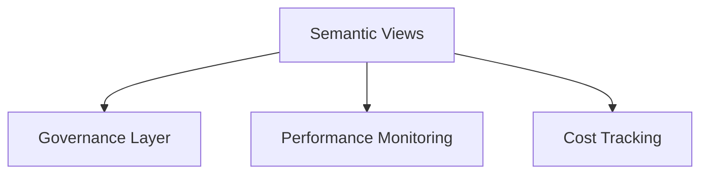

# Performance & Best Practices for Semantic Views

## ⚡ Performance Tips
- Avoid overly complex joins in semantic views; materialize as intermediate tables.  
- Add clustering keys to underlying tables for better performance.  
- Use caching (result sets) for expensive aggregations.  

## 💰 Cost Optimization
- Dedicate a warehouse for semantic workloads.  
- Restrict compute size for ad-hoc semantic queries.  
- Monitor usage via ACCOUNT_USAGE views.  

## 🔐 Security Best Practices
- Use RBAC: only allow Analysts to query, not modify semantic views.  
- Apply row access policies if sensitive dimensions exist (PII, salary).  

## 📘 Governance
- Document metric definitions in Confluence/dbt docs.  
- Align business terms with semantic view names.  

---

## Diagram

