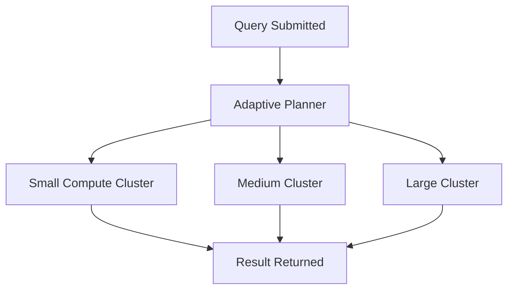

# Snowflake Adaptive Compute (Feb 2025)

Snowflake **Adaptive Compute** is a 2025 feature that dynamically scales compute resources at query-level granularity. Unlike static warehouse sizing, Adaptive Compute lets Snowflake assign just the right resources per workload, improving efficiency and cost control.

---

## 📖 Contents

1. [Introduction](./2-intro.md)  
2. [Setup](./3-setup.md)  
3. [Usage & Scenarios](./4-usage-and-scenarios.md)  
4. [Testing & Validation](./5-testing-and-validation.md)  
5. [CI/CD & Deployment](./6-ci-cd-and-deployment.md)  
6. [Performance & Best Practices](./7-performance-and-best-practices.md)  
7. [Resources](./8-resources.md)

---

## 📊 Diagram

---

## 🎯 Learning Outcomes
- Understand Adaptive Compute fundamentals.  
- Enable and configure adaptive scaling.  
- Use Adaptive Compute for diverse workloads (batch, streaming, BI).  
- Automate deployment and testing.  
- Optimize cost/performance balance.

---

Next: [2-intro.md](./2-intro.md)
