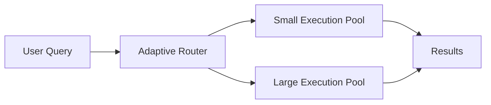

# Introduction to Adaptive Compute

## ❓ What is Adaptive Compute?
Adaptive Compute is Snowflake’s evolution of virtual warehouses — compute now scales at query-level, selecting optimal resources based on workload complexity.

---

## 🌟 Why it matters
- Static warehouse sizing → risk of over/under-provisioning.  
- Adaptive Compute → smart scaling with fewer manual decisions.  

Benefits:
- **Efficiency**: smaller queries don’t waste XL warehouses.  
- **Speed**: large queries automatically get boosted resources.  
- **Cost control**: pay only for what is needed.

---

## 📘 Example Story
A BI dashboard query runs on a small compute slice. A heavy ML feature engineering job runs simultaneously but gets extra compute instantly — without manual warehouse switching.

---

## Diagram

---

Next: [3-setup.md](./3-setup.md)
