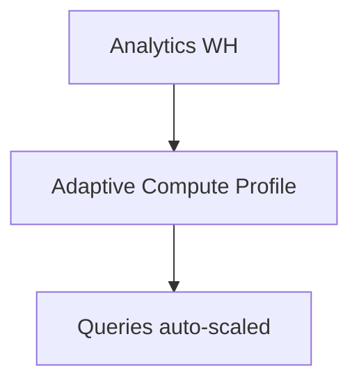

# Setting up Adaptive Compute

## 🔑 Enabling Adaptive Compute
Adaptive Compute may be controlled by an account parameter:

```sql
alter account set ENABLE_ADAPTIVE_COMPUTE = true;
```

Check status:
```sql
show parameters like 'ENABLE_ADAPTIVE_COMPUTE';
```

---

## 🛠️ Configuring Policies
- Define workload categories (BI, batch, ML).  
- Assign adaptive compute profiles per warehouse or schema.  

```sql
alter warehouse analytics_wh set ADAPTIVE_COMPUTE = 'ENABLED';
```

---

## 📊 Diagram



---

Next: [4-usage-and-scenarios.md](./4-usage-and-scenarios.md)
