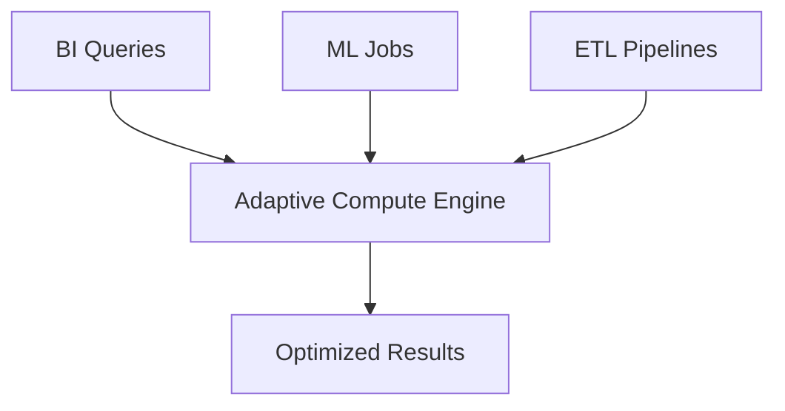

# Usage & Scenarios of Adaptive Compute

## Typical Workloads

### 1. BI Dashboards
- Light queries → auto-assign small compute.  
- Peak usage → elastic scale-up.  

### 2. Data Science
- Training queries → large compute.  
- Prediction queries → small compute.  

### 3. Streaming Pipelines
- Adaptive compute allocates burst resources only when new data arrives.

---

## Example SQL
```sql
select customer_id, sum(amount) as revenue
from sales
group by customer_id;
```

If Snowflake detects heavy aggregation → assign larger cluster.  

---

## Diagram



---

Next: [5-testing-and-validation.md](./5-testing-and-validation.md)
