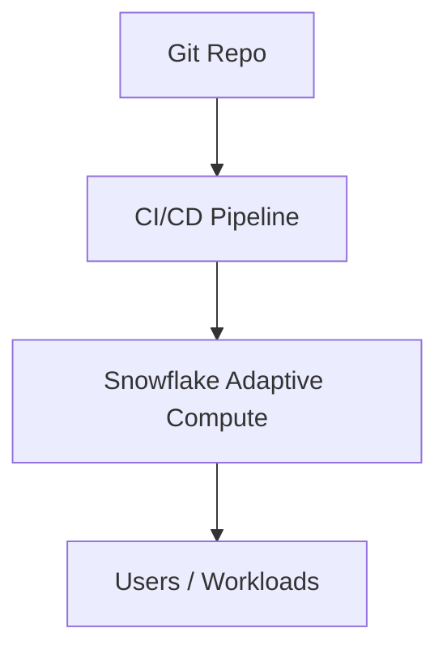

# CI/CD & Deployment for Adaptive Compute

## Why automate?
- Ensure adaptive settings are consistently applied.  
- Validate performance improvements before rollout.  

---

## GitHub Actions Example

```yaml
name: adaptive-compute-ci
on: [push]

jobs:
  deploy:
    runs-on: ubuntu-latest
    steps:
      - uses: actions/checkout@v4
      - name: Configure Adaptive Compute
        run: |
          snowsql -a ${{ secrets.SF_ACCOUNT }} -u ${{ secrets.SF_USER }} -p ${{ secrets.SF_PASSWORD }} -q "
          alter warehouse analytics_wh set ADAPTIVE_COMPUTE = 'ENABLED';"
```

---

## Promotion Flow
- Dev: run benchmarks with adaptive compute.  
- Staging: validate mixed workloads.  
- Prod: enable account-wide.  

---

## Diagram



---

Next: [7-performance-and-best-practices.md](./7-performance-and-best-practices.md)
