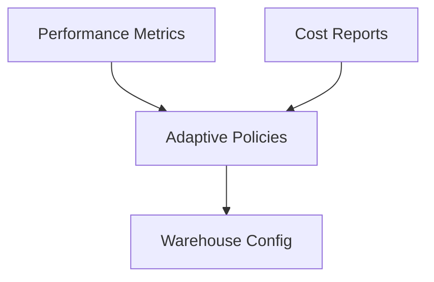

# Performance & Best Practices for Adaptive Compute

## ⚡ Performance
- Use adaptive for mixed workloads.  
- Monitor query history for scaling patterns.  
- Tag queries to group performance metrics.

## 💰 Cost
- Track credits per workload category.  
- Ensure long-running batch jobs don’t hog resources.  

## 🔐 Governance
- Restrict who can enable/disable adaptive compute.  
- Document policies for usage.

---

## Diagram

---

Next: [8-resources.md](./8-resources.md)
