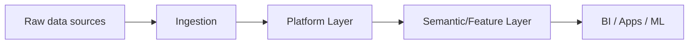

# Snowflake AI Agents — README

Welcome to the **Snowflake AI Agents** module (published September 05, 2025). This folder contains a focused learning pack with practical examples, commands, architectures, and best practices.

## Contents

- [README](./1-README.md)
- [Introduction](./2-intro.md)
- [Setup](./3-setup.md)
- [Usage & Scenarios](./4-usage-and-scenarios.md)
- [Testing & Validation](./5-testing-and-validation.md)
- [CI/CD & Deployment](./6-ci-cd-and-deployment.md)
- [Performance & Best Practices](./7-performance-and-best-practices.md)
- [Resources](./8-resources.md)

## Quick architecture

## How to use this module

Start with the Introduction, follow Setup to enable features, then use Usage & Scenarios and CI/CD to operate at scale. Use Resources for deeper links.

---

[Next](./2-intro.md)
