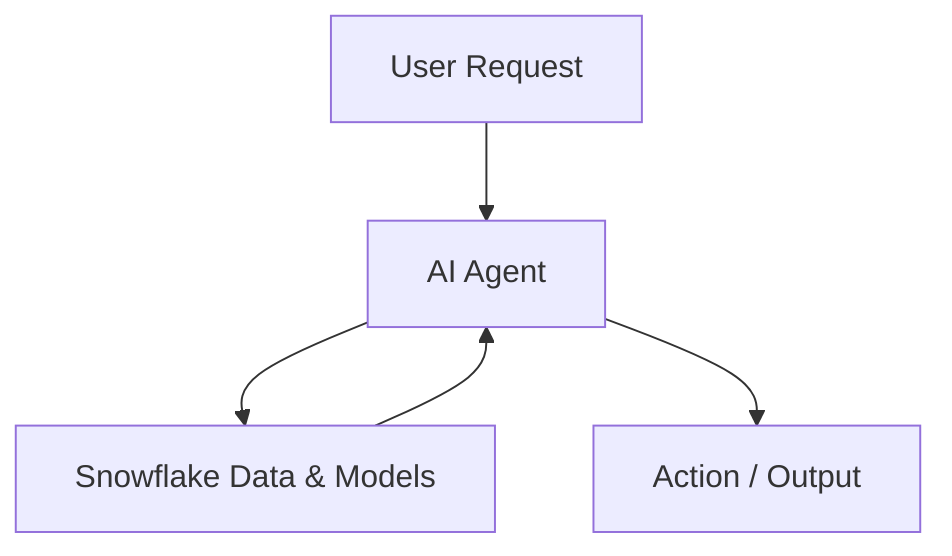

# Snowflake AI Agents — Introduction

This introduction explains motivations, essential concepts, and what problems **Snowflake AI Agents** solves.

## What are AI Agents in Snowflake?

AI Agents are managed, server-side agent objects that can orchestrate data-driven conversations, prediction tasks, or automated workflows. They can call models, run queries, and produce structured outputs for downstream systems.

---

[Previous](./1-README.md) • [Next](./3-setup.md)
